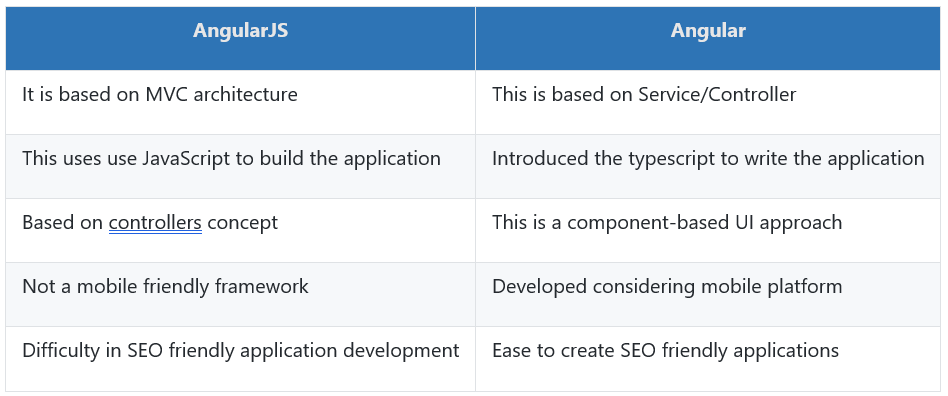
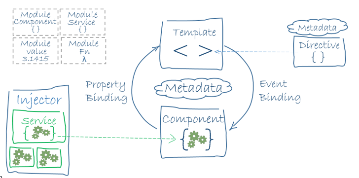
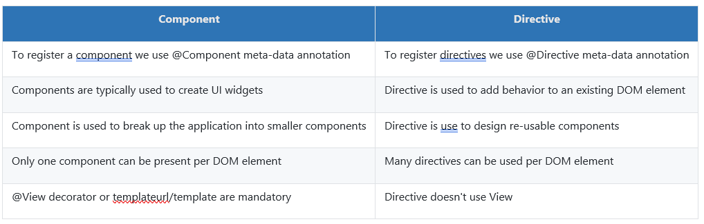

# Angular Interview Questions

## 1.  What is Angular Framework?
   * Angular is a TypeScript-based open-source front-end platform that makes it easy to build applications with in web/mobile/desktop. The major features of this framework such as  declarative templates, dependency injection, end to end tooling, and many more other features are used to ease the development.

## 2. What is the difference between AngularJS and Angular?
   * Angular is a completely revived component-based framework in which an application is a tree of individual components.
   * Some of the major difference below
    

## 3. What is TypeScript?
   *   TypeScript is a typed superset of JavaScript created by Microsoft that adds optional types, classes, async/await, and   many other features, and compiles to plain JavaScript. Angular built entirely in TypeScript and used as a primary language. You can install it globally as
   ``` javascript
       npm install -g typescript
   ```
   * Let's see a simple example of TypeScript usage:

  ``` javascript
      function greeter(person: string) {
          return "Hello, " + person;
      }
      let user = "Sudheer";
      document.body.innerHTML = greeter(user);
  ```
## 4. Write a pictorial diagram of Angular architecture?
   *  

## 5. What are the key components of Angular?
   * Angular has the below key components:
      * __`Component`__: These are the basic building blocks of angular application to control HTML views.
      * __`Modules`__: An angular module is set of angular basic building blocks like component, directives, services etc. An   application is divided into logical pieces and each piece of code is called as "module" which perform a single task.
      * __`Templates`__: This represent the views of an Angular application.
      * __`Services`__: It is used to create components which can be shared across the entire application.
      * __`Metadata`__: This can be used to add more data to an Angular class.
## 6. What are directives?
   * Directives add behavior to an existing DOM element or an existing component instance.
      ``` javascript
           import { Directive, ElementRef, Input } from '@angular/core';

           @Directive({ selector: '[myHighlight]' })
           export class HighlightDirective {
               constructor(el: ElementRef) {
                 el.nativeElement.style.backgroundColor = 'yellow';
               }
           }
      ```
   * Now this directive extends HTML element behavior with a yellow background as below
      ``` javascript
           <p myHighlight>Highlight me!</p>
      ```

## 7.	What are components?
   * Components are the most basic UI building block of an Angular app which formed a tree of Angular components. These components are subset of directives. Unlike directives, components always have a template and only one component can be instantiated per an element in a template. Let's see a simple example of Angular component
     ``` javascript
      import { Component } from '@angular/core';

      @Component ({
        selector: 'my-app',
        template: ` <div>
            <h1>{{title}}</h1>
            <div>Learn Angular6 with examples</div>
        </div> `,
      })     

      export class AppComponent {
        title: string = 'Welcome to Angular world';
      }
     ``` 
## 8.	What are the differences between Component and Directive?
   * In a short note, A component`(@component)` is a directive-with-a-template.
   * Some of the major differences are mentioned below:
   *  

## 9.	What is a template?
   * A template is a HTML view where you can display data by binding controls to properties of an Angular component. You can store your component's template in one of two places. You can define it inline using the template property, or you can define the template in a separate HTML file and link to it in the component metadata using the @Component decorator's templateUrl property.
   * __`Using inline template with template syntax,`__
   
  ``` javascript
      import { Component } from '@angular/core';

      @Component ({
        selector: 'my-app',
        template: '
            
            <div>
              <h1>{{title}}</h1>
              <div>Learn Angular</div>
            </div>
        '

      })

      export class AppComponent {
        title: string = 'Hello World';
      }
  ``` 
  * __`Using separate template file such as app.component.html`__

  ``` javascript
      import { Component } from '@angular/core';

      @Component ({
        selector: 'my-app',
        templateUrl: 'app/app.component.html'
      })

      export class AppComponent {
        title: string = 'Hello World';
      }
  ```   
## 10.	What is a module?
   * Modules are logical boundaries in your application and the application is divided into separate modules to separate the functionality of your application. Lets take an example of app.module.ts root module declared with `@NgModule` decorator as below:
  ``` javascript
      import { NgModule }      from '@angular/core';
      import { BrowserModule } from '@angular/platform-browser';
      import { AppComponent }  from './app.component';

      @NgModule ({
        imports:      [ BrowserModule ],
        declarations: [ AppComponent ],
        bootstrap:    [ AppComponent ],
        providers: []
      })
      export class AppModule { }
  ```
  * The NgModule decorator has five important(among all) options
  * The `imports` option is used to import other dependent modules. The BrowserModule is required by default for any web based angular application.
  * The `declarations` option is used to define components in the respective module.
  * The `bootstrap` option tells Angular which Component to bootstrap in the application.
  * The `providers` option is used to configure set of injectable objects that are available in the injector of this module.
  * The `entryComponents` option is a set of components dynamically loaded into the view.
     
