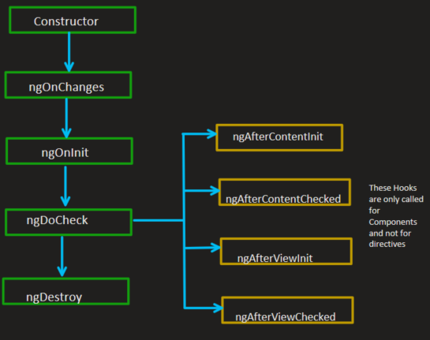
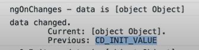

# Angular Interview Questions

## 1.  What is Angular Framework?
   * Angular is a TypeScript-based open-source front-end platform that makes it easy to build applications with in web/mobile/desktop. The major features of this framework such as  declarative templates, dependency injection, end to end tooling, and many more other features are used to ease the development.

## 2. What is the difference between AngularJS and Angular?
   * Angular is a completely revived component-based framework in which an application is a tree of individual components.
   * Some of the major difference below
    

## 3. What is TypeScript?
   *   TypeScript is a typed superset of JavaScript created by Microsoft that adds optional types, classes, async/await, and   many other features, and compiles to plain JavaScript. Angular built entirely in TypeScript and used as a primary language. You can install it globally as
   ``` javascript
       npm install -g typescript
   ```
   * Let's see a simple example of TypeScript usage:

  ``` javascript
      function greeter(person: string) {
          return "Hello, " + person;
      }
      let user = "Sudheer";
      document.body.innerHTML = greeter(user);
  ```
## 4. Write a pictorial diagram of Angular architecture?
   *  

## 5. What are the key components of Angular?
   * Angular has the below key components:
      * __`Component`__: These are the basic building blocks of angular application to control HTML views.
      * __`Modules`__: An angular module is set of angular basic building blocks like component, directives, services etc. An   application is divided into logical pieces and each piece of code is called as "module" which perform a single task.
      * __`Templates`__: This represent the views of an Angular application.
      * __`Services`__: It is used to create components which can be shared across the entire application.
      * __`Metadata`__: This can be used to add more data to an Angular class.
## 6. What are directives?
   * Directives add behavior to an existing DOM element or an existing component instance.
      ``` javascript
           import { Directive, ElementRef, Input } from '@angular/core';

           @Directive({ selector: '[myHighlight]' })
           export class HighlightDirective {
               constructor(el: ElementRef) {
                 el.nativeElement.style.backgroundColor = 'yellow';
               }
           }
      ```
   * Now this directive extends HTML element behavior with a yellow background as below
      ``` javascript
           <p myHighlight>Highlight me!</p>
      ```

## 7.	What are components?
   * Components are the most basic UI building block of an Angular app which formed a tree of Angular components. These components are subset of directives. Unlike directives, components always have a template and only one component can be instantiated per an element in a template. Let's see a simple example of Angular component
     ``` javascript
      import { Component } from '@angular/core';

      @Component ({
        selector: 'my-app',
        template: ` <div>
            <h1>{{title}}</h1>
            <div>Learn Angular6 with examples</div>
        </div> `,
      })     

      export class AppComponent {
        title: string = 'Welcome to Angular world';
      }
     ``` 
## 8.	What are the differences between Component and Directive?
   * In a short note, A component`(@component)` is a directive-with-a-template.
   * Some of the major differences are mentioned below:
      

## 9.	What is a template?
   * A template is a HTML view where you can display data by binding controls to properties of an Angular component. You can store your component's template in one of two places. You can define it inline using the template property, or you can define the template in a separate HTML file and link to it in the component metadata using the @Component decorator's templateUrl property.
   * __`Using inline template with template syntax,`__
   
  ``` javascript
      import { Component } from '@angular/core';

      @Component ({
        selector: 'my-app',
        template: '
            
            <div>
              <h1>{{title}}</h1>
              <div>Learn Angular</div>
            </div>
        '

      })

      export class AppComponent {
        title: string = 'Hello World';
      }
  ``` 
  * __`Using separate template file such as app.component.html`__

  ``` javascript
      import { Component } from '@angular/core';

      @Component ({
        selector: 'my-app',
        templateUrl: 'app/app.component.html'
      })

      export class AppComponent {
        title: string = 'Hello World';
      }
  ```   
## 10.	What is a module?
   * Modules are logical boundaries in your application and the application is divided into separate modules to separate the functionality of your application. Lets take an example of app.module.ts root module declared with `@NgModule` decorator as below:
  ``` javascript
      import { NgModule }      from '@angular/core';
      import { BrowserModule } from '@angular/platform-browser';
      import { AppComponent }  from './app.component';

      @NgModule ({
        imports:      [ BrowserModule ],
        declarations: [ AppComponent ],
        bootstrap:    [ AppComponent ],
        providers: []
      })
      export class AppModule { }
  ```
  * The NgModule decorator has five important(among all) options
  * The `imports` option is used to import other dependent modules. The BrowserModule is required by default for any web based angular application.
  * The `declarations` option is used to define components in the respective module.
  * The `bootstrap` option tells Angular which Component to bootstrap in the application.
  * The `providers` option is used to configure set of injectable objects that are available in the injector of this module.
  * The `entryComponents` option is a set of components dynamically loaded into the view.
     
## 11.	What are lifecycle hooks available?

Life cycle hook :
 
* __`constructor`__
  * This will invoked when Anuglar creates a component or directive by calling `new` on the class.
  * In this stage, properties doesnt carry values, most of the time it will be `undefined`.
* __`ngOnChanges`__
  * This invokes whenever the changes happens to the `@input` properties in the component.
  * Here we can see the values assigned to the properties in the perticular component.
  * Using `SimpleChange` interface we can have access to previous and current values of the properties in the component
  ``` javascript
    ngOnChanges(changes: SimpleChange) {
      console.log(`ngOnChange - data is ${this.data}`)
      for(let key in changes) {
        console.log(`${key} changed.
          Current: ${changes[key].currentValue}.
          Previous: ${changes[key].previousValue}
        `);
      }
    }
  ```
  

* __`ngOnInIt`__
  - It invokes when the given component has been initalized.
  - This will called `only once` after the first `ngOnChanges`
* __`ngDoCheck`__
  - Invokes when the change detector of the given component is invoked. It allows us to implement our own change detection algorithm for the given component.
  - __`ngDoCheck and ngOnChanges should not be implemented together on the same component.`__
    *  __`ngAfterContentInit`__
      - Invokes after Angular performs any content projection(<ng-context></ng-context>) into the component's view.
    *  __`ngAfterContentChecked`__
      - Invokes each time the content of the given component has been checked by the change detection mechanism of Angular.
    *  __`ngAfterViewInit`__
      - Invoked when the components view has been fully initialized.
    *  __`ngAfterViewChecked`__
      - Invoked each time the view of the given component has been checked by the change detection mechanism of Angular.
* __`ngOnDestroy`__
  * This method will be invoked just before Angular destorys the component.
  * Use this Hook to unsubscribe observables and detach event handlers to avoid memory leaks.


## 12.	What is Data Binding?
* Data binding is a core concept in angular and allows to define communication between a component and the DOM, making it very easy to define interactive applications without worrying about Pushing and Pulling data. There are 3 different ways to do Data Binding.
  - From Component to DOM:
    - `Interpolation:{{ value }}:` Adds the value of a property from the component
      ``` javascript
        <li>Name: {{ user.name }}</li>
        <li>Address: {{ user.address }}</li>
      ```
    - `Property binding: [property]=”value”: ` The value is passed from the component to the specified property or simple HTML attribute
      ``` javascript
        <input type="email" [value]="user.email">
      ```
  - `From the DOM to the Component: Event binding: (event) = function:`  when a specific DOM event happens (ex: click, change, keyup) call the specified method in the component.
    ``` javascript
      <button (click)="logout()"></button>  
    ```
  - `Two-way binding: Two-way data binding: [(ngModel)]="value": ` Two-way data binding allows to have the data flow both ways.
    ``` javascript
      <input type="email" [(ngModel)]="user.email">
    ```
## 13.	What is Metadata?
*   Metadata is used to decorate a class, so that it can be configure the expected behaviour of the class. There are different ways to define:
  * `Class Decorator:` @Component and @NgModule
  ``` javascript
      import { NgModule, Component } from '@angular/core';

      @Component({
        selector: 'my-component',
        template: '<div>Class decorator</div>',
      })
      export class MyComponent {
        constructor() {
          console.log('Hey I am a component!');
        }
      }

      @NgModule({
        imports: [],
        declarations: [],
      })
      export class MyModule {
        constructor() {
          console.log('Hey I am a module!');
        }
      }
  ```
  * `Property Decorator: ` Used for properties inside classes, e.g. @Input and @Output
    ``` javascript
      import { Component, Input } from '@angular/core';

      @Component({
          selector: 'my-component',
          template: '<div>Property decorator</div>'
      })

      export class MyComponent {
          @Input()
          title: string;
      }
    ```
  * `Method Decorator: ` Used for methods inside classes, e.g. @HostListener
  ``` javascript
     import { Component, HostListener } from '@angular/core';

      @Component({
          selector: 'my-component',
          template: '<div>Method decorator</div>'
      })
      export class MyComponent {
          @HostListener('click', ['$event'])
          onHostClick(event: Event) {
              // clicked, `event` available
          }
      }
  ```
  * `Parameter Decorator: ` Used for parameters inside class constructors, e.g. @Inject, Optional
  ``` javascript
      import { Component, Inject } from '@angular/core';
      import { MyService } from './my-service';

      @Component({
          selector: 'my-component',
          template: '<div>Parameter decorator</div>'
      })
      export class MyComponent {
          constructor(@Inject(MyService) myService) {
              console.log(myService); // MyService
          }
      }
  ```

## 14.	What is angular CLI?
* Angular CLI is a command line interface to scaffold and build angular apps using nodejs modules. Command to install Angular CLI:
   ``` javascript
      npm install @angular/cli@latest
   ```
* Below are the list of few commands, which will come handy while creating angular projects
  * Creating New Project: ng new

* Generating Components, Directives & Services: ng generate/g The different types of commands would be,
  * ng generate class my-new-class: add a class to your application
  * ng generate component my-new-component: add a component to your application
  * ng generate directive my-new-directive: add a directive to your application
  * ng generate enum my-new-enum: add an enum to your application
  * ng generate module my-new-module: add a module to your application
  * ng generate pipe my-new-pipe: add a pipe to your application
  * ng generate service my-new-service: add a service to your application
* Running the Project: ng serve

## 15.	What is the difference between constructor and ngOnInit?
* TypeScript classes has a default method called constructor which is normally used for the initialization purpose. Whereas ngOnInit method is specific to Angular, especially used to define Angular bindings. Even though constructor getting called first, it is preferred to move all of your Angular bindings to ngOnInit method. In order to use ngOnInit, you need to implement OnInit interface as below:
  ``` javascript
    export class App implements OnInit{
        constructor(){
          //called first time before the ngOnInit()
        }

        ngOnInit(){
          //called after the constructor and called  after the first ngOnChanges()
        }
      }
  ```

## 16.  What is a service?
* A Service is used when a common functionality needs to be provided to various modules. Services allow for greater separation of concerns for your application and better modularity by allowing you to extract common functionality out of components.

* Let's create a repoService which can be used across components:
 ``` javascript
    import { Injectable } from '@angular/core';
    import { Http } from '@angular/http';

    @Injectable({ // The Injectable decorator is required for dependency injection to work
      // providedIn option registers the service with a specific NgModule
      providedIn: 'root',  // This declares the service with the root app (AppModule)
    })
    export class RepoService{
      constructor(private http: Http){
      }

      fetchAll(){
        return this.http.get('https://api.github.com/repositories');
      }
    }
 ```

## 17.  What is a Dependency Injection in Angular?
* Dependency Injection(DI), is an important application design pattern in which a class asks for dependencies from external sources rather than creating them itself. Angular comes with its own dependency injection framework for resolving dependencies( services or objects that a class needs to perform its function).So you can have your services depend on other services throughout your application.

## 18.  How is Dependency Hierarchy formed?
* https://www.w3resource.com/angular/hierarchical-dependency-injectors.php#:~:text=The%20Angular%20dependency%20injection%20system,level%20of%20that%20component%20tree.&text=You%20can%20configure%20providers%20for%20different%20injectors%20in%20the%20injector%20hierarchy.

## 19.  What is the purpose of async pipe?
* The AsyncPipe subscribes to an observable or promise and returns the latest value it has emitted. When a new value is emitted, the pipe marks the component to be checked for changes.

Let's take a time observable which continuously updates the view for every 2 seconds with the current time.

    ``` javascript
     @Component({
        selector: 'async-observable-pipe',
        template: `<div><code>observable|async</code>:
            Time: {{ time | async }}</div>`
      })
      export class AsyncObservablePipeComponent {
        time = new Observable(observer =>
          setInterval(() => observer.next(new Date().toString()), 2000)
        );
      }
    ```
## 20.  What is the option to choose between inline and external template file?
